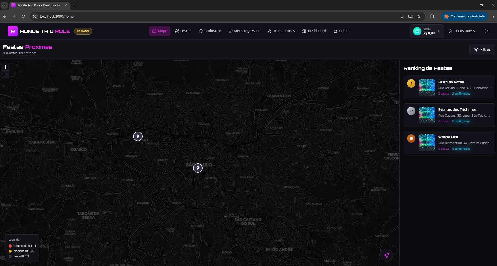
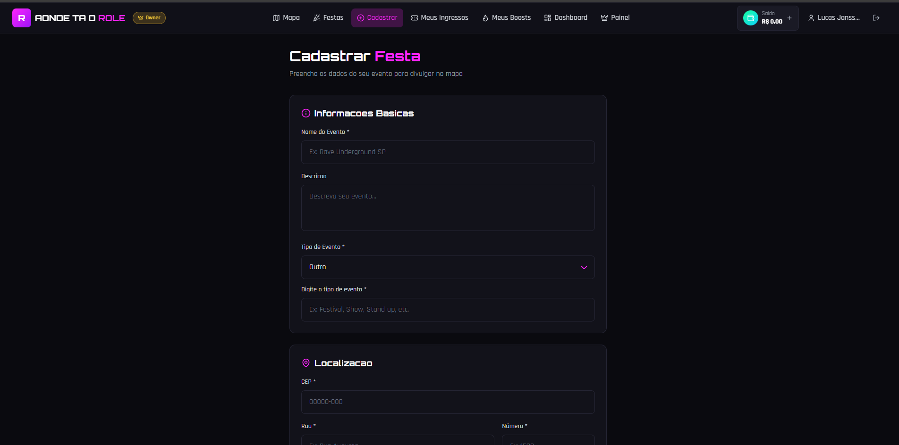
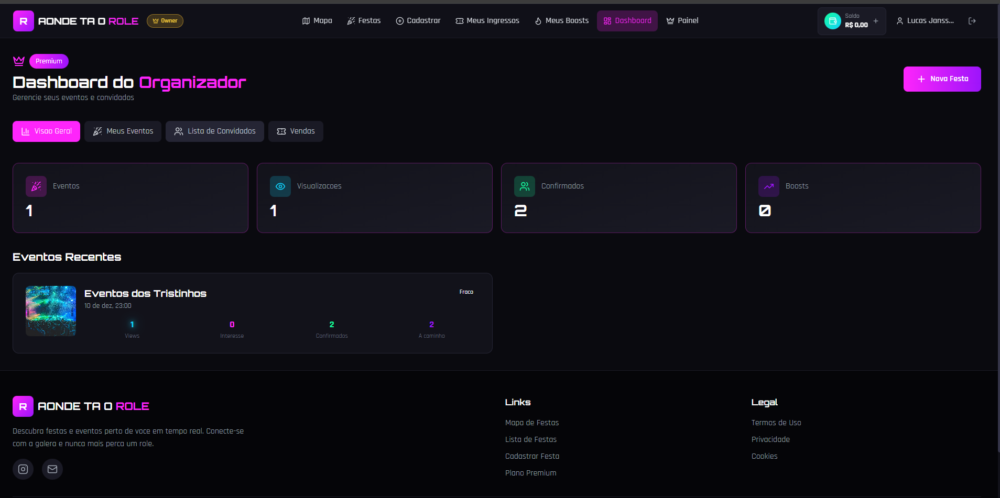
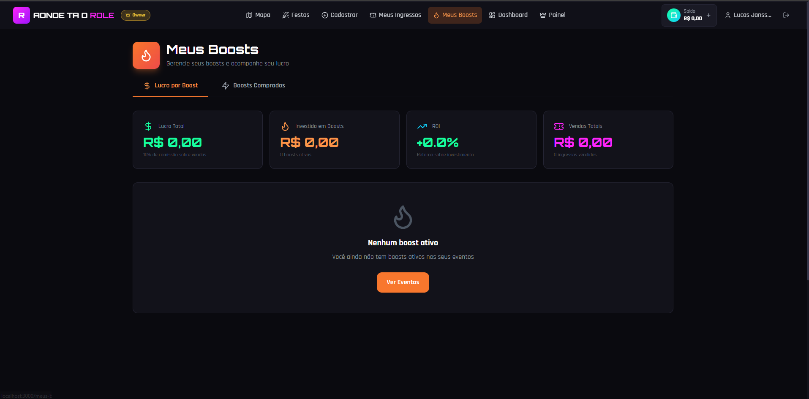
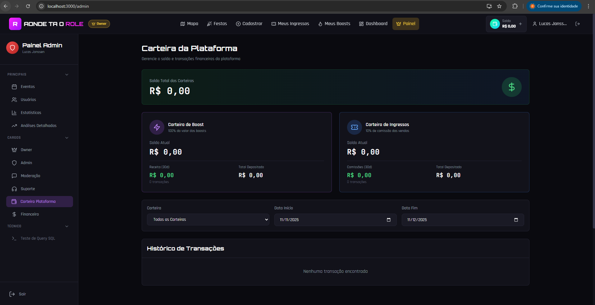
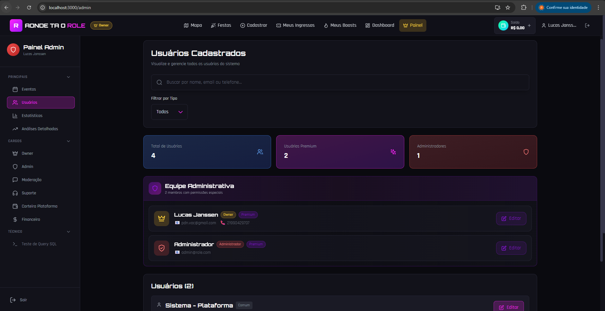

  
  
  # 🎉 Aonde Ta o Role
  
  **Plataforma completa para descobrir festas e eventos em tempo real**
  
  
  
  
  
  
  
  [Demo](https://ondetaorole.vercel.app) • [Screenshots](#-screenshots) • [Instalação](#-instalação) • [Funcionalidades](#-funcionalidades)

## Sobre o Projeto

Basicamente, é um app web que mostra festas e eventos no mapa. Você pode ver onde tem role perto de você, cadastrar seus próprios eventos, dar boost nas festas (pagar pra aparecer mais) e ter um dashboard se for premium.

A ideia é tipo um "Tinder de festas" mas com mapa e geolocalização. Funciona como PWA, então dá pra instalar no celular e usar quase como app nativo.

## Stack

- **Next.js 14** - Framework React
- **TypeScript** - Tipagem
- **Tailwind CSS** - Estilização
- **Zustand** - Gerenciamento de estado
- **Leaflet** - Mapas (OpenStreetMap)
- **Firebase Auth** - Autenticação (preparado, mas ainda não integrado)

## O que tem no projeto

## 📸 Screenshots

  <table>
    <tr>
      <td align="center">
        
         <strong>Mapa de Eventos</strong>
      </td>
      <td align="center">
        
         <strong>Cadastro de Festas</strong>
      </td>
    </tr>
    <tr>
      <td align="center">
        
         <strong>Dashboard do Organizador</strong>
      </td>
      <td align="center">
        
         <strong>Sistema de Boost</strong>
      </td>
    </tr>
    <tr>
      <td align="center">
        
         <strong>Carteira da Plataforma</strong>
      </td>
      <td align="center">
        
         <strong>Gestão de Usuários</strong>
      </td>
    </tr>
  </table>

### Rotas principais

- `/home` - Mapa com os eventos
- `/festas` - Lista e ranking de festas
- `/cadastro-festa` - Formulário pra criar evento
- `/dashboard` - Painel do organizador (só premium)
- `/login` - Login
- `/registro` - Cadastro
- `/perfil` - Perfil do usuário
- `/premium` - Info do plano premium
- `/termos` - Termos de uso

### Funcionalidades

**Mapa Interativo**
- Mostra eventos no mapa
- Pega sua localização
- Classifica por popularidade:
  - 🔥 Bombando (100+ pessoas)
  - ⚡ Mediano (30-100 pessoas)
  - 💤 Fraco (0-30 pessoas)

**Cadastro de Festas**
- Nome, descrição, endereço
- Coordenadas (pode colocar manual ou usar GPS)
- Capacidade máxima
- Faixa etária
- Tipo de evento
- Imagem de capa
- Entrada grátis ou paga

**Sistema de Boost**
- Cada boost custa R$ 0,20
- Aumenta a visibilidade no ranking
- Destaque no mapa
- (Pagamento ainda não está integrado, só a estrutura)

**Plano Premium**
- Dashboard pra gerenciar eventos
- Lista de convidados
- Exportar dados (CSV/PDF)
- Estatísticas
- Controle de confirmações

## APIs e Bibliotecas

**Mapa**
- OpenStreetMap (via CartoDB Dark) - tiles do mapa
- Leaflet - biblioteca de mapas
- React-Leaflet - componentes React pro Leaflet

**Geolocalização**
- Geolocation API nativa do navegador

**Autenticação** (preparado, mas não integrado)
- Firebase Auth - Google e Email/Senha

**Pagamentos** (preparado, mas não integrado)
- PIX - integração futura
- Gateway de pagamento - ainda não definido

## PWA

O projeto funciona como PWA, então:
- Dá pra instalar na tela inicial do celular
- Funciona parcialmente offline
- Notificações push (estrutura pronta, mas não implementado)
- Experiência tipo app nativo

### Como instalar

1. Abre no navegador
2. Clica no ícone de instalação ou "Adicionar à tela inicial"
3. Confirma

## Estrutura do Código

A arquitetura foi pensada pra facilitar migração futura pra React Native:
- Lógica separada da UI (stores independentes)
- Types compartilhados (TypeScript)
- Componentes modulares
- API pronta pra reutilizar

## Status Atual

**O que está funcionando:**
- Interface completa
- Mapa com eventos
- Cadastro de festas
- Sistema de boost (simulado)
- Dashboard premium (simulado)
- PWA configurado

**O que está mockado/simulado:**
- Autenticação (dados mock)
- Pagamentos (boost e premium simulados)
- Dados dos eventos (em memória, não persiste)
- Notificações (estrutura pronta, mas não funciona)

**Observações:**
- Os ícones do PWA precisam ser gerados pra produção
- Tudo que é mockado precisa ser integrado com backend real

## 📞 Contato

  

